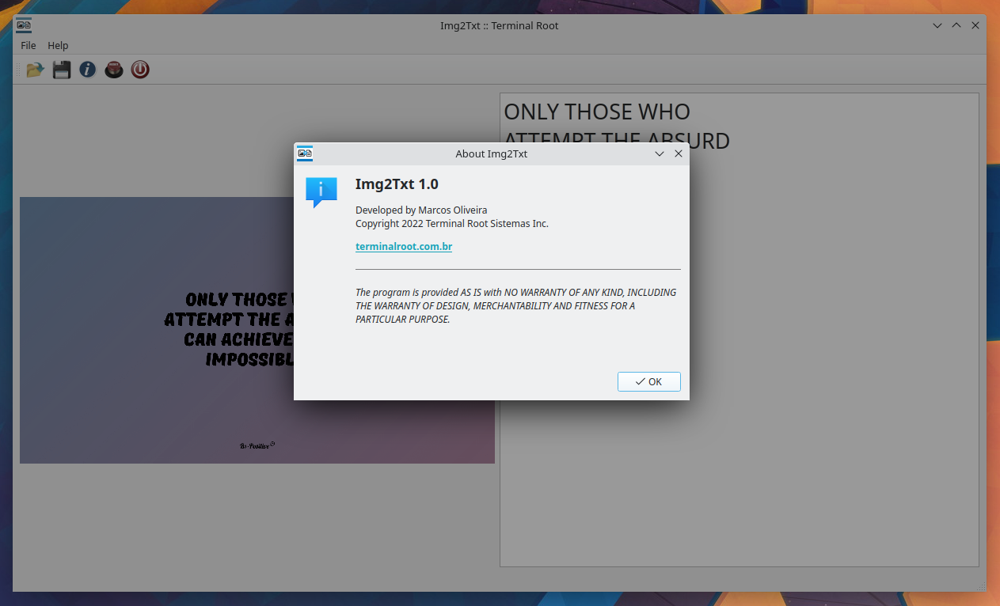

# Img2Txt

 

Graphic application to extract text from image

---

# Dependencies
+ [gcc/g++](https://gcc.gnu.org/)
+ [CMake](https://cmake.org/)
+ [Make](https://www.gnu.org/software/make/)
+ [Qt](https://www.qt.io/)
+ [OpenCV](https://github.com/opencv/opencv)
+ [Leptonica](https://github.com/DanBloomberg/leptonica)
+ [Tesseract](https://github.com/tesseract-ocr/tesseract)

Example of dependencies on [Ubuntu](https://ubuntu.com/):

Download and install [from here](https://www.qt.io/download-qt-installer), like this [video](https://www.youtube.com/watch?v=2fXBeN1EUzs) .
> Remember the path where you installed it and add Qt6 support and Qt5 compatibility

And now install the packages:
```bash
sudo apt install build-essential cmake make g++ libtesseract-dev libopencv-dev
```

---

# Building and Install
> Change `PATH/TO/Qt` by the path where you installed Qt

And then clone, build and install:

> **NOTE**: `[PATH/TO]/Qt/[VERSION]` is the location you installed **Qt** and the **Version** number, example: `${HOME}/Qt/6.3.0`
```bash
git clone https://github.com/terroo/img2txt
cd img2txt
mkdir build && cd build
cmake -DQT_DIR_VER="[PATH/TO]/Qt/[VERSION]"
make
sudo make install
sudo chmod +x /usr/local/bin/img2txt # IMPORTANT POS INSTALL
```

---

# Screenshots

 

---

